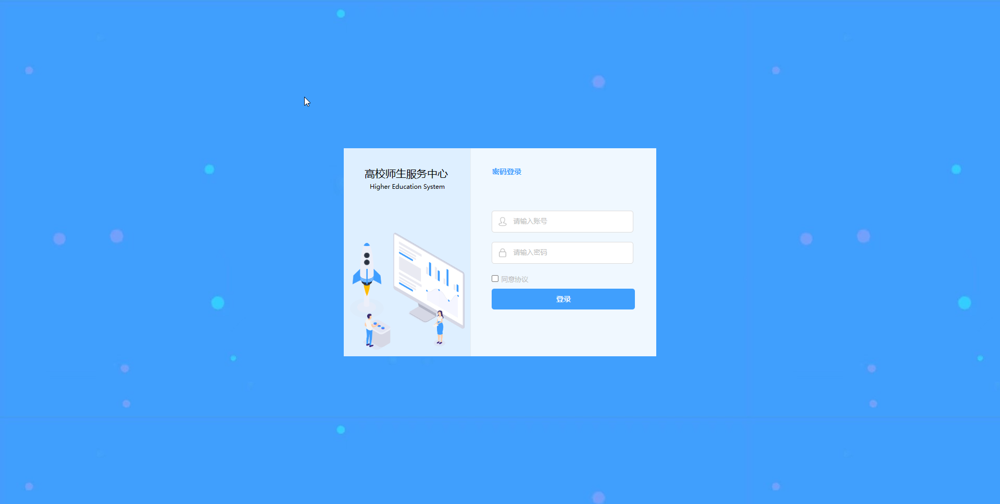
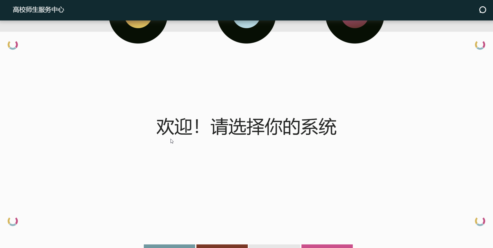
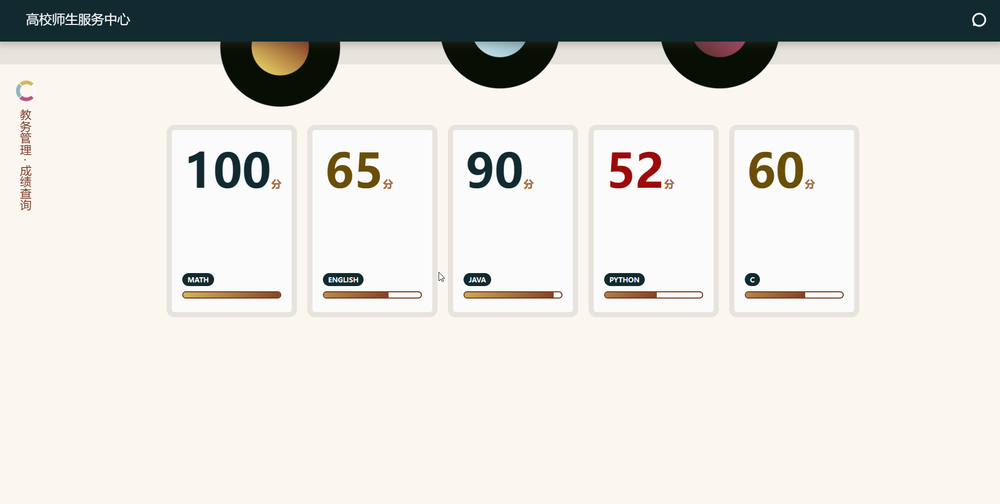
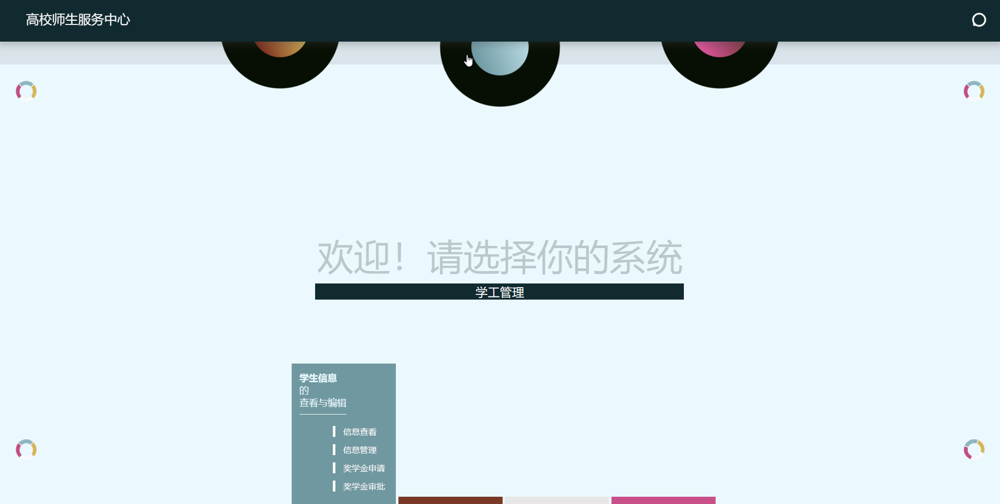
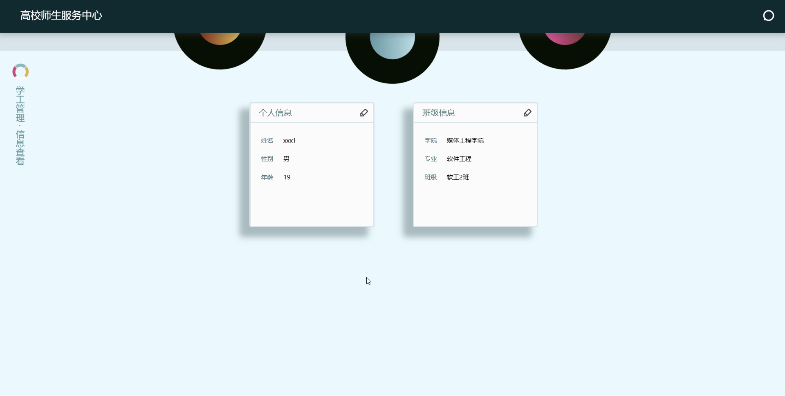
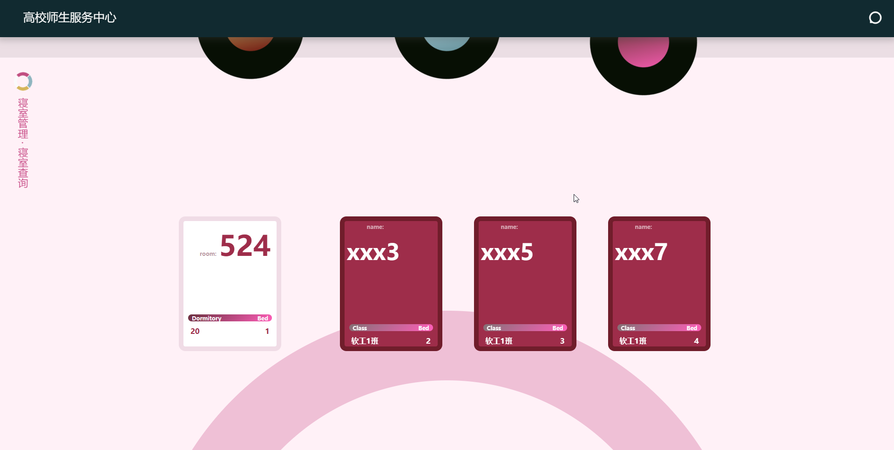

# 软件工程概论课程设计

## 一、项目背景

熟悉软件工程的基本概念，掌握软件工程的基本方法，掌握软件工程的基本技术，掌握软件工程的基本工具，掌握软件工程的基本过程，掌握软件工程的基本规范，掌握软件工程的基本文档，掌握软件工程的基本管理，掌握软件工程的基本实践。

## 二、项目目标

开发一个简单的软件工程课程设计管理系统，了解并熟悉软件工程的基本概念，掌握软件工程的基本方法，掌握软件工程的基本技术，掌握软件工程的基本工具，掌握软件工程的基本过程，掌握软件工程的基本规范，掌握软件工程的基本文档，掌握软件工程的基本管理，掌握软件工程的基本实践。

## 三、项目内容

### 1. 项目名称

高校学生师生服务中心

### 2. 项目功能

1. 教务系统 成绩管理，考勤管理
2. 学工系统 信息查看，奖学金管理
3. 住宿系统 维修申请，寝室管理

### 3. 项目简介

- 前端：HTML、CSS、JavaScript、JQuery、axios
- 后端：SpringBoot、MyBatis-plus、MySQL、JWT
- 项目管理：Maven
- 项目部署：nginx 反向代理
- 项目版本管理：Git
- 项目协作：Github
- 接口文档：https://www.apifox.cn/apidoc/shared-4cb3900a-7755-48ec-ae7a-3f5beb306045
- 项目地址：http://1.117.80.52/cms

### 4. 项目特点

- 前后端分离
- 前端主要熟练了原生动画书写
- 后端主要设计了基于角色的权限管理 采用开源框架Sa-Token进行二次开发 完成对JWT的封装 并对业务进行了拓展

## 四、演示

- 学生账号 账号123456 密码123456
- 教务系统管理员账号 账号918832 密码382515
- 学工系统管理员账号 账号795868 密码898742
- 住宿系统管理员账号 账号852943 密码517185

1. 登录效果图
2. 首页效果图
3. 教务系统效果图
4. 学工系统效果图
5. 学工详情效果图
6. 寝室系统效果图

## 五、项目启动
1. 前端 修改axios的接口地址 使用nginx或者github pages部署
2. 后端 修改yml配置文件 并使用maven打包成jar包  运行jar包即可 
3. 数据库 使用sql文件导入数据库 
